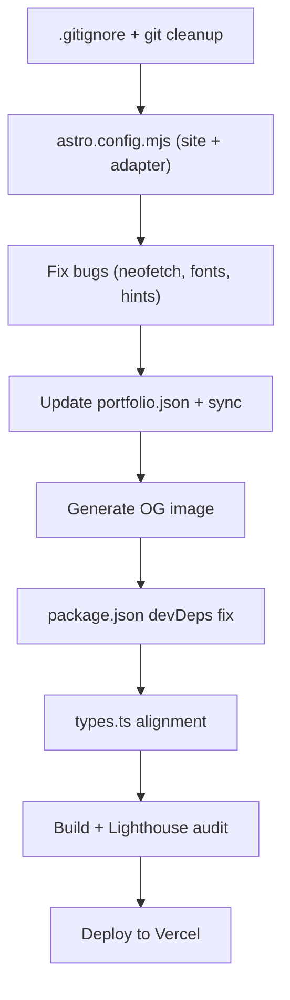

# Portfolio Website — Implementation Plan

> **Goal:** Take Joel's ThinkPad terminal portfolio from "functional" to "deployed and polished."  
> Three phases: **Deploy Prep → Content & Fixes → Polish & Performance.**

## User Review Required

> [!IMPORTANT]
> **Deployment target:** The handoff specifies Vercel. Should I proceed with Vercel, or do you prefer Netlify/Cloudflare Pages/GitHub Pages?

> [!WARNING]
> **Privacy risk:** `docs/personal/database.md` contains your personal phone number (+91 98407 53301). This file should NOT be in a public repository. I'll add it to `.gitignore` — confirm if you want it removed from git history entirely.

> [!IMPORTANT]
> **Audio:** `public/sounds/ambient.mp3` is a 44-byte placeholder (broken). Should I:
> - (A) Generate/source a subtle ambient hum sound effect?
> - (B) Remove the AudioBar feature entirely until you provide a real audio file?
> - (C) Keep the component but hide it by default?

## Open Questions

1. **Custom domain** — Do you already have `joelalfredisrael.dev` or another domain ready for deployment?
2. **AgentOS GitHub URL** — The prompt uses `https://github.com/Joel01010/agentos` — is this the correct repo URL? (Your GitHub appears to be `Joel01010`)
3. **Additional projects** — `database.md` lists 16 projects but only 9 are in `portfolio.json`. Want me to add the missing ones (Carta, Bionary Blog, Uni-Union-Website, Digital Well-Being App, etc.)?
4. **Chatbot backend** — The `ezra` chat command calls Ollama locally. Should this be disabled/stubbed for production, or do you plan to host a backend?

---

## Proposed Changes

### Phase 1 — Deploy Prep (Priority 1)

Foundation work to get the project git-clean and deployment-ready.

---

#### [NEW] [.gitignore](file:///d:/portfolio-draft/.gitignore)

Standard Astro `.gitignore`:
```
node_modules/
dist/
.astro/
.env
.env.*
*.log
.DS_Store
Thumbs.db
.vscode/
docs/personal/database.md
```

> [!NOTE]
> `docs/personal/database.md` is included to prevent the phone number from being committed publicly. The `llm_context.md` file (which doesn't have the phone number) remains tracked.

---

#### [MODIFY] [astro.config.mjs](file:///d:/portfolio-draft/astro.config.mjs)

- Add `site: 'https://joelalfredisrael.dev'` (or whatever the final domain is) so OG meta tags resolve correctly at build time.
- Add Vercel adapter for serverless deployment (if Vercel is confirmed).

---

#### Git Cleanup

- Stage all new Astro files: `git add -A`
- Commit legacy file deletions + new codebase: `git commit -m "chore: migrate from jQuery to Astro 5 + React 19"`
- Verify clean `git status`

---

### Phase 2 — Content & Bug Fixes (Priority 2)

Fix known bugs, update content, and add missing assets.

---

#### [MODIFY] [portfolio.json](file:///d:/portfolio-draft/src/data/portfolio.json)

- **Add AgentOS project** with the data from the handoff prompt
- Sync changes to `public/data/portfolio.json` (or better: eliminate the duplicate and have commands.ts use a runtime fetch if needed)

---

#### [MODIFY] [neofetch.ts](file:///d:/portfolio-draft/src/terminal/neofetch.ts)

- **Remove unused `_owner` variable** at line 116. The `data?.owner?.name` and `data?.owner?.title` direct accesses on lines 134-135 already work without it.

---

#### [MODIFY] [global.css](file:///d:/portfolio-draft/src/styles/global.css)

- **Remove the `@import url('https://fonts.googleapis.com/...')` line.** Fonts are already loaded via `<link>` preconnect in `Layout.astro`. The CSS `@import` is render-blocking and causes double-loading.

---

#### [MODIFY] [Layout.astro](file:///d:/portfolio-draft/src/layouts/Layout.astro)

- Update OG image meta tag to point to a real image (after generating one).
- Verify all meta tags have correct `site` URL.

---

#### [NEW] OG Image — `public/og-image.png`

Generate a 1200×630 Open Graph image showing the ThinkPad terminal aesthetic (dark background, amber terminal text, "Joel Alfred Israel — Developer" tagline). This fixes the 404 on social sharing previews.

---

#### [MODIFY] [package.json](file:///d:/portfolio-draft/package.json)

- Move `@types/react`, `@types/react-dom`, `@astrojs/check`, and `typescript` from `dependencies` to `devDependencies`.

---

#### [MODIFY] [commands.ts](file:///d:/portfolio-draft/src/terminal/commands.ts)

- Fix misleading `cd projects && ls` hint — change to show `cd projects` and `ls` as separate commands, or implement `&&` chaining (simpler to fix the hint).

---

### Phase 3 — Polish & Performance (Priority 3)

Performance optimizations and quality-of-life improvements.

---

#### [MODIFY] [types.ts](file:///d:/portfolio-draft/src/terminal/types.ts)

- Add missing fields to `PortfolioData` interface: `certifications`, `achievements`, `research` — matching what actually exists in `portfolio.json`.
- Add `huggingface` to `Contact` interface.

---

#### Performance Fixes

| Fix | File | Impact |
|-----|------|--------|
| Remove duplicate `@import` font loading | `global.css` | Eliminates render-blocking CSS import |
| Verify font `display=swap` in Google Fonts URL | `Layout.astro` | Prevents FOIT (Flash of Invisible Text) |
| Run `npx astro build` and check bundle size | — | Baseline performance metrics |
| Run Lighthouse audit | — | Identify remaining issues |

---

#### Mobile Responsiveness Review

The laptop CSS already has breakpoints at 820px and 480px, but needs verification:
- Test the terminal at small viewport sizes (xterm `FitAddon` should handle this)
- Verify touch/tap interactions work for the terminal
- Check boot overlay legibility on mobile

---

#### Accessibility Audit

Existing accessibility is good (skip link, `aria-hidden`, `prefers-reduced-motion`). Additional checks:
- Verify keyboard navigation through all interactive elements
- Check color contrast ratios on all 4 themes
- Test with screen reader (the terminal paradigm is inherently accessible since it's all text)

---

## Verification Plan

### Automated Tests
```bash
# TypeScript check
npx astro check

# Production build (catches SSR/import issues)
npx astro build

# Lighthouse CI (after dev server is running)
# Manual: open Chrome DevTools → Lighthouse tab
```

### Manual Verification
1. **Dev server** — `npm run dev`, verify all 30+ commands work
2. **Build** — `npx astro build`, verify clean build with no errors
3. **Mobile** — Chrome DevTools responsive mode at 375px, 768px, 1024px
4. **Social preview** — Verify OG image renders with [https://opengraph.xyz](https://opengraph.xyz) (post-deployment)
5. **Git** — `git status` shows clean working tree
6. **Deploy** — Vercel preview deployment, verify live URL works

---

## Execution Order



**Estimated effort:** ~45 minutes for Phase 1+2, ~30 minutes for Phase 3.
