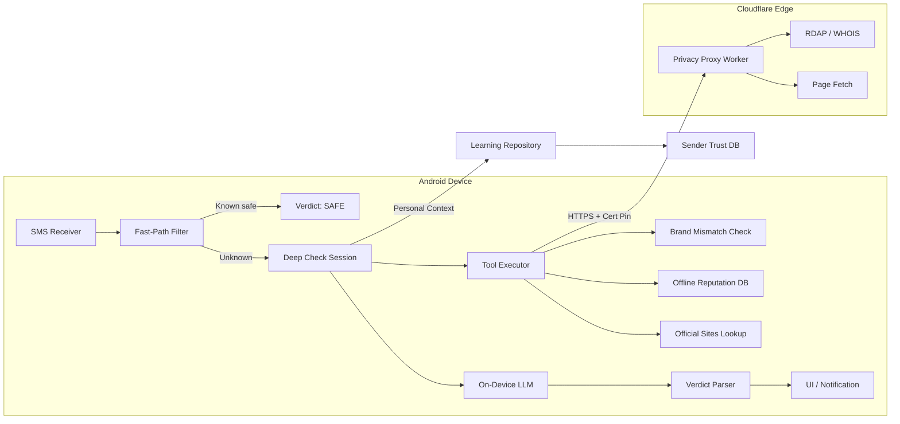

# SMSentry

**AI-powered SMS security for Android** — an intelligent messaging app that uses on-device AI and cloud-assisted analysis to detect scam messages in real time.

SMSentry serves as a full replacement for your default SMS app while adding a powerful **Deep Check** engine that analyzes suspicious messages, identifies scam patterns, and learns from your feedback over time.

> **Status:** v1.1.0 · Min SDK 26 (Android 8.0) · Target SDK 35

---

## Features

| Category | Feature | Description |
|---|---|---|
| 🛡️ **AI Analysis** | Deep Check | Multi-tool AI pipeline that investigates messages for scam indicators |
| 🧠 **Learning** | Personal Learning | Bayesian trust scoring that adapts to your feedback per sender |
| 🔍 **Investigation** | Brand Mismatch Detection | Compares claimed sender identity against official domains |
| 🌐 **Investigation** | WHOIS Lookup | Checks domain registration age via privacy proxy |
| 📄 **Investigation** | Page Fetch & Analysis | Fetches linked URLs to inspect content for red flags |
| 📊 **Investigation** | Offline Reputation DB | Local scam pattern database for instant lookups |
| 🚫 **Protection** | Blocked Numbers | System-level call/SMS blocking |
| 💬 **Messaging** | Full SMS/MMS | Send, receive, search, and compose messages |
| ⚡ **Performance** | Fast-Path Filter | Instant verdicts for allowlisted senders and known-safe patterns |
| 🔒 **Security** | Encrypted Database | SQLCipher + Android Keystore encryption at rest |
| 🎨 **UI** | Material 3 | Jetpack Compose UI with dynamic theming |

---

## Architecture Overview

SMSentry uses a **privacy-first architecture** where SMS content never leaves the device in plaintext. The Cloudflare Worker acts as a privacy proxy for external lookups (WHOIS, page fetching) without ever seeing message content.



### Key Data Flows

1. **SMS Received** → `SmsReceiver` broadcasts → written to system SMS provider → conversation list refreshes
2. **Deep Check Triggered** → Fast-path filter → tool pre-execution → enriched prompt → on-device LLM inference → verdict parsed → UI updated
3. **User Feedback** → stored in `user_feedback` table → sender trust score recomputed → influences future Deep Check context

---

## Tech Stack

| Layer | Technology | Version |
|---|---|---|
| **Language** | Kotlin | JVM 17 |
| **UI** | Jetpack Compose + Material 3 | BOM 2025.02 |
| **Navigation** | Navigation Compose | 2.8.8 |
| **DI** | Hilt (Dagger) | 2.59.2 |
| **Database** | Room + SQLCipher | Room 2.8.4 / SQLCipher 4.6.1 |
| **Networking** | OkHttp | 5.0.0-alpha.14 |
| **Serialization** | Kotlinx Serialization | 1.8.0 |
| **AI Runtime** | LiteRT-LM (Google AI Edge) | 0.13.1 |
| **Preferences** | DataStore | 1.1.3 |
| **Privacy Proxy** | Cloudflare Workers | — |
| **Testing** | JUnit 4 + Robolectric + MockK | — |

---

## Security Highlights

SMSentry implements defense-in-depth security. For full details, see [SECURITY.md](SECURITY.md).

- **Data at rest** — SQLCipher-encrypted Room database; passphrase managed via Android Keystore (AES-256-GCM)
- **Data in transit** — TLS with OkHttp certificate pinning to Cloudflare's intermediate CAs
- **SSRF protection** — Dual-layer: client-side IP validation (`FetchPageTool`) + server-side URL blocking (Cloudflare Worker)
- **Prompt injection defense** — XML delimiter tags (`<sms_content>`) isolate untrusted SMS text from system instructions
- **PII minimization** — `body_preview` (50 chars) + `body_hash` (SHA-256) stored instead of full message bodies
- **Android hardening** — `allowBackup=false`, unexported internal receivers, network security config

---

## Build & Run

### Prerequisites

| Requirement | Version |
|---|---|
| Android Studio | Ladybug or later |
| JDK | 17 (bundled with Android Studio) |
| Android SDK | API 35 |
| ADB | Latest platform-tools |

### Build

```powershell
# Set JAVA_HOME to Android Studio's bundled JDK
$env:JAVA_HOME = "C:\Program Files\Android\Android Studio\jbr"

# Debug build
.\gradlew.bat assembleDebug
```

### Deploy

```powershell
# Install to connected device/emulator
adb install -r app\build\outputs\apk\debug\app-debug.apk
```

> [!IMPORTANT]
> SMSentry must be set as the **default SMS app** on the device to receive SMS/MMS broadcasts. Android will prompt for this on first launch.

### Release Build

1. Create `keystore.properties` in the project root:
   ```properties
   storeFile=path/to/keystore.jks
   storePassword=...
   keyAlias=...
   keyPassword=...
   ```
2. Uncomment the `signingConfigs` block in `app/build.gradle.kts`
3. Run `.\gradlew.bat assembleRelease`

---

## Configuration

### Proxy API Key

The Cloudflare Worker URL and API key are set as `buildConfigField` values in [`app/build.gradle.kts`](../app/build.gradle.kts):

```kotlin
buildConfigField("String", "PROXY_URL", "\"https://your-worker.workers.dev\"")
buildConfigField("String", "PROXY_API_KEY", "\"your-api-key-here\"")
```

### Cloudflare Worker

The privacy proxy worker lives in [`cloudflare-worker/`](../cloudflare-worker/). See [CONTRIBUTING.md](CONTRIBUTING.md) for deployment instructions.

---

## Project Structure

```
SMSentry/
├── app/
│   └── src/main/java/com/smssentry/
│       ├── MainActivity.kt              # Entry point, permission handling
│       ├── SMSSentryApp.kt              # Hilt application class
│       ├── data/
│       │   ├── model/                   # Data models (DeepCheckVerdict, etc.)
│       │   ├── repository/              # SmsRepository, RealSMSSentryAI
│       │   ├── security/               # DatabaseKeyManager (Keystore)
│       │   └── util/                    # ContactResolver
│       ├── deepcheck/
│       │   ├── data/                    # DeepCheckDatabase, DAOs, entities
│       │   ├── model/                   # LlmInferenceEngine, VerdictParser
│       │   ├── prefilter/               # FastPathFilter
│       │   ├── proxy/                   # PrivacyProxyClient
│       │   ├── session/                 # DeepCheckSession (main pipeline)
│       │   ├── tools/                   # ToolExecutor, FetchPageTool, etc.
│       │   ├── ui/                      # ModelDownloadScreen
│       │   └── util/                    # HashUtil, TextSanitizer, Diagnostics
│       ├── di/                          # Hilt AppModule
│       ├── domain/                      # Interfaces (SMSSentryAI, etc.)
│       ├── learning/
│       │   ├── PersonalLearningRepository.kt
│       │   └── data/                    # SenderTrustEntity, UserFeedbackEntity
│       ├── sms/                         # SmsReceiver, MmsReceiver, Notifications
│       └── ui/
│           ├── chat/                    # Chat thread screen
│           ├── compose/                 # New message composer
│           ├── conversations/           # Conversation list screen
│           ├── detail/                  # Message detail / AI analysis
│           ├── navigation/              # NavGraph, Screen routes
│           ├── settings/                # Settings, blocked numbers
│           ├── components/              # Shared UI components
│           └── theme/                   # Material 3 theming
├── cloudflare-worker/
│   └── src/
│       └── index.js                     # Privacy proxy endpoints
├── docs/                                # Documentation (you are here)
└── gradle/                              # Gradle wrapper
```

---

## Further Reading

- [Architecture Deep Dive](ARCHITECTURE.md) — modules, data flow, DI graph, database schema
- [Security Documentation](SECURITY.md) — threat model, encryption, SSRF, prompt injection
- [Contributing Guide](CONTRIBUTING.md) — dev setup, code style, deployment

---

## License

This project is private. All rights reserved.
